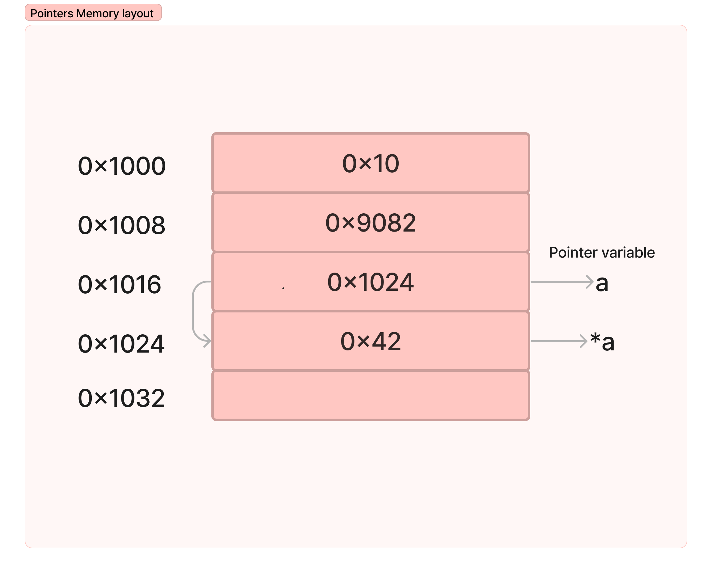
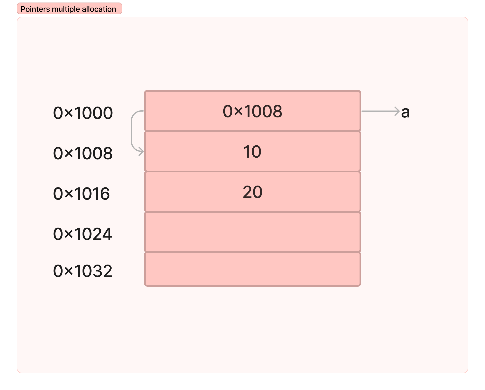
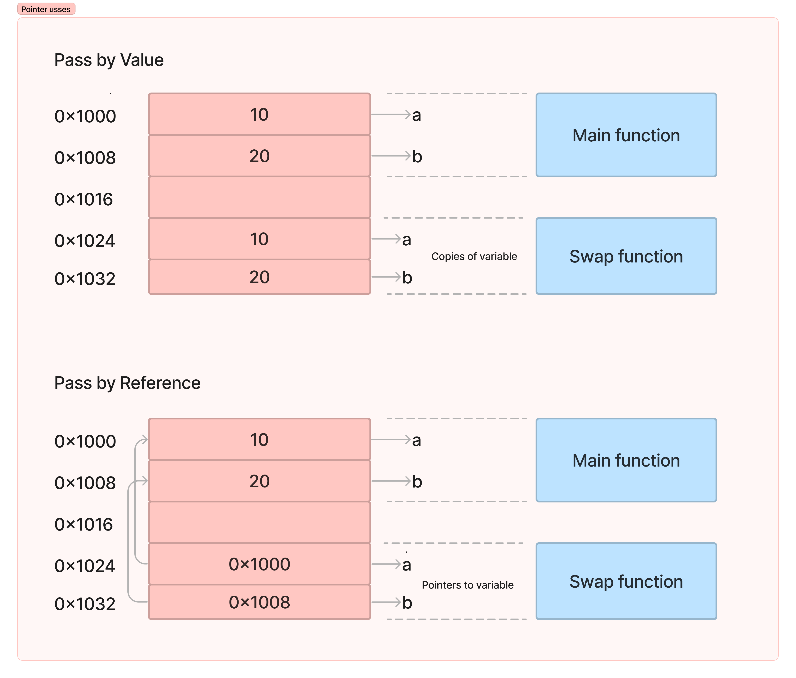
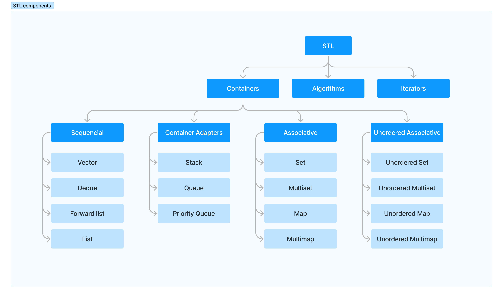
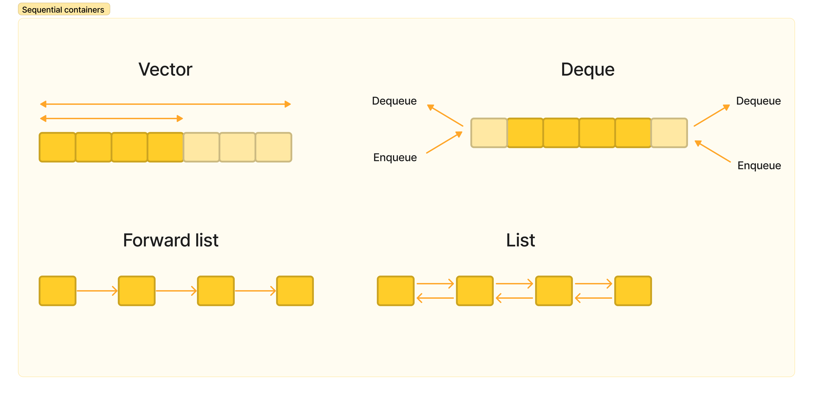
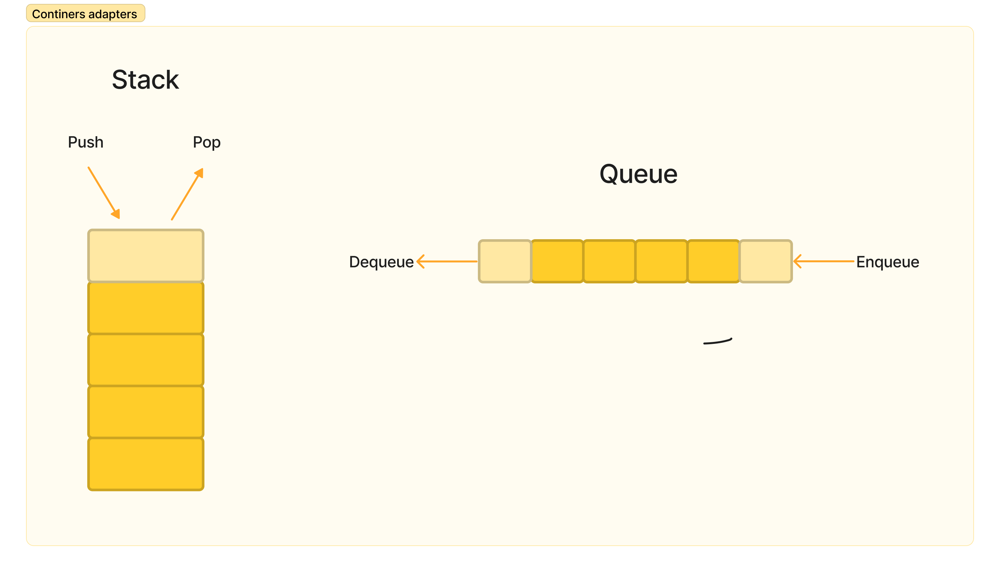
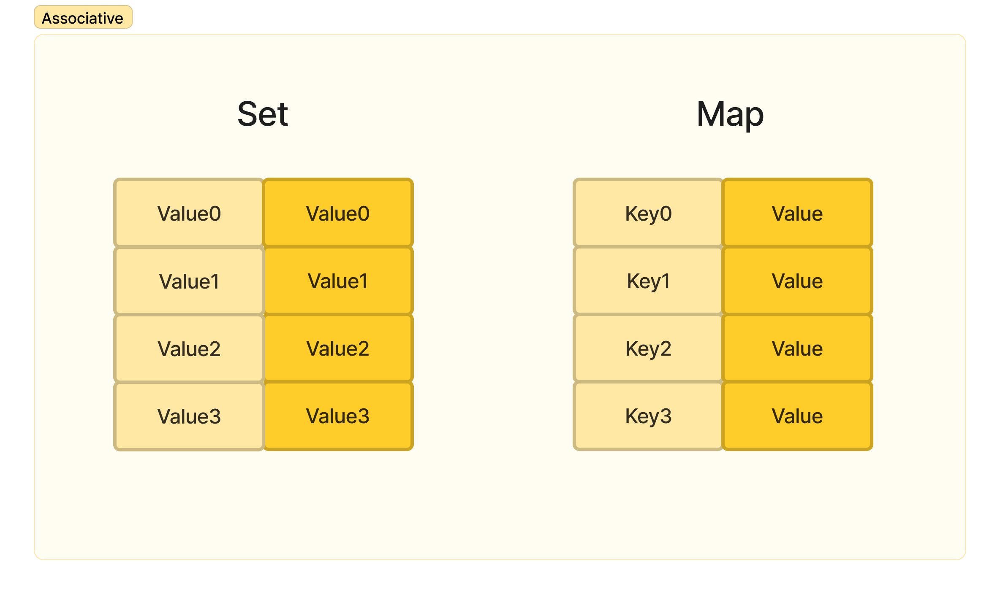

# Pointers and STL
This folder contains all the code related to pointers and the STL (Standard Template Library).

You can learn more about pointer [here](https://www.geeksforgeeks.org/cpp-pointers/) and about STL [here](https://www.geeksforgeeks.org/the-c-standard-template-library-stl/).

You can see the STL reference [here](https://cplusplus.com/reference/stl/).

## Pointer

## STL
#### STL components

#### Sequential containers

| Container    |  Description |
|--------------|--------------|
| [Vector](https://cplusplus.com/reference/vector/vector/)       |Vectors are sequence containers representing arrays that can change in size. |
|[Deque](https://cplusplus.com/reference/deque/deque/)| Double-ended queues are sequence containers with dynamic sizes that can be expanded or contracted on both ends (either its front or its back).|
| [Forward List](https://cplusplus.com/reference/forward_list/forward_list/) |Forward lists are sequence containers that allow constant time insert and erase operations anywhere within the sequence.Forward lists are implemented as singly-linked lists.|
| [List](https://cplusplus.com/reference/list/list/) | Lists are sequence containers that allow constant time insert and erase operations anywhere within the sequence, and iteration in both directions. List containers are implemented as doubly-linked lists.|

#### Container adapters

#### Associative containers
